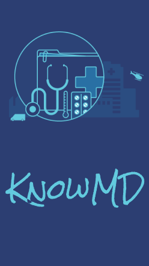
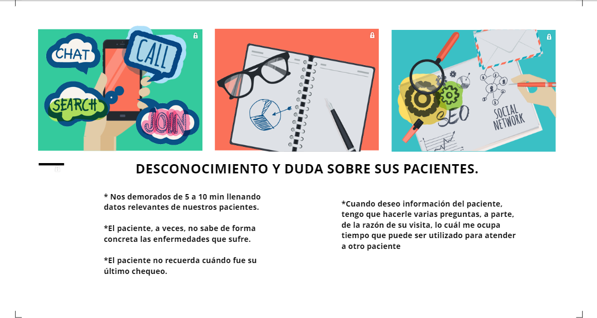
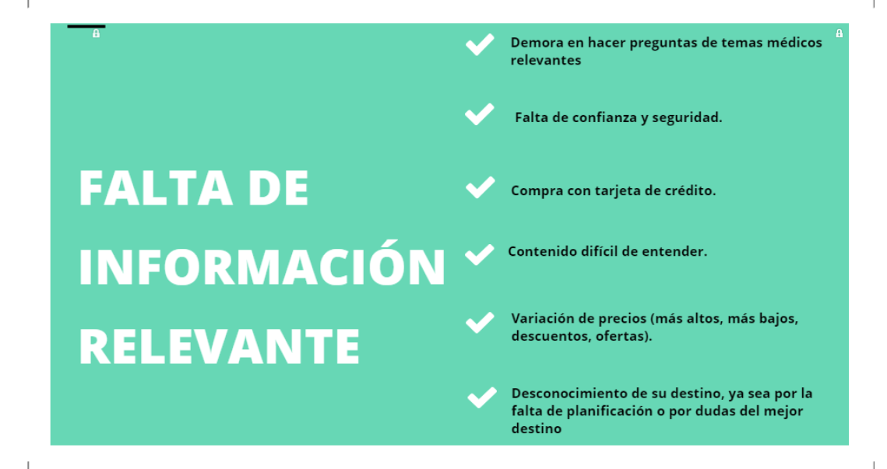
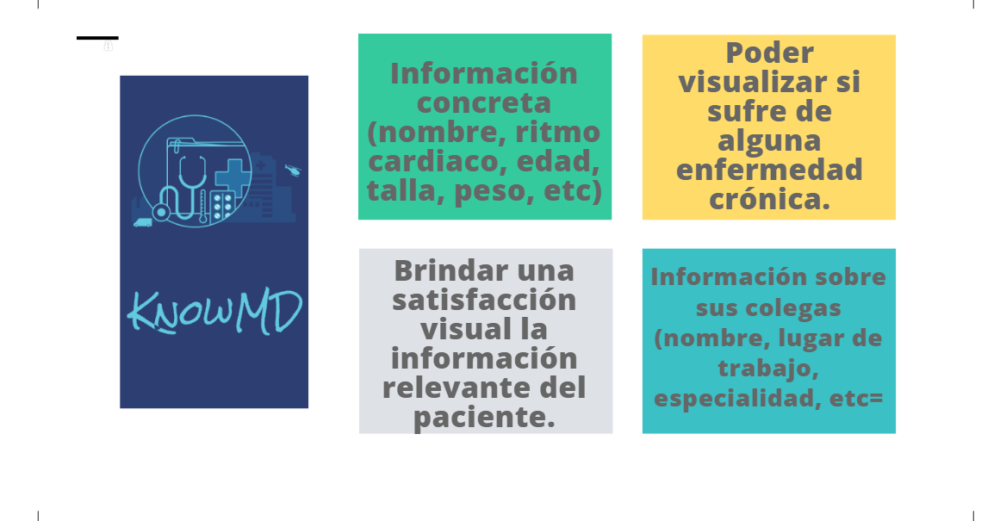
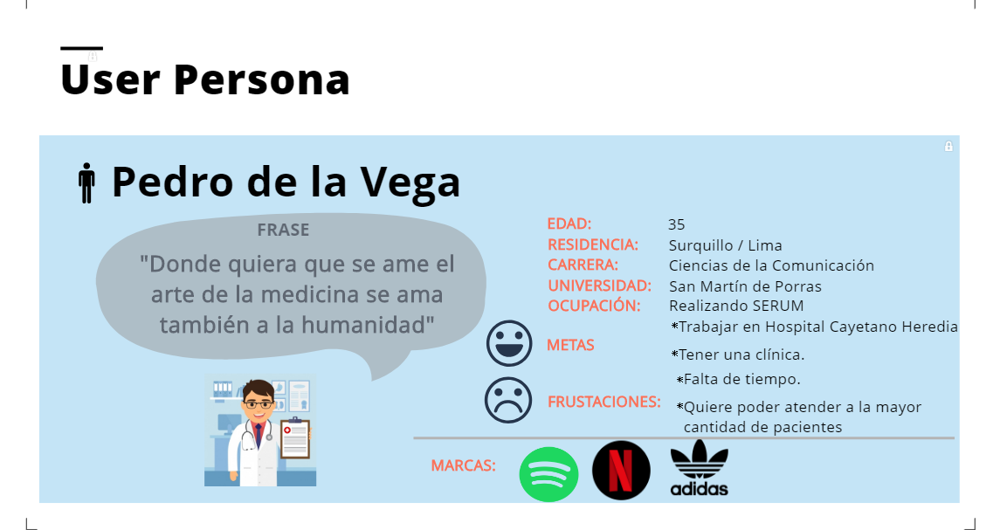
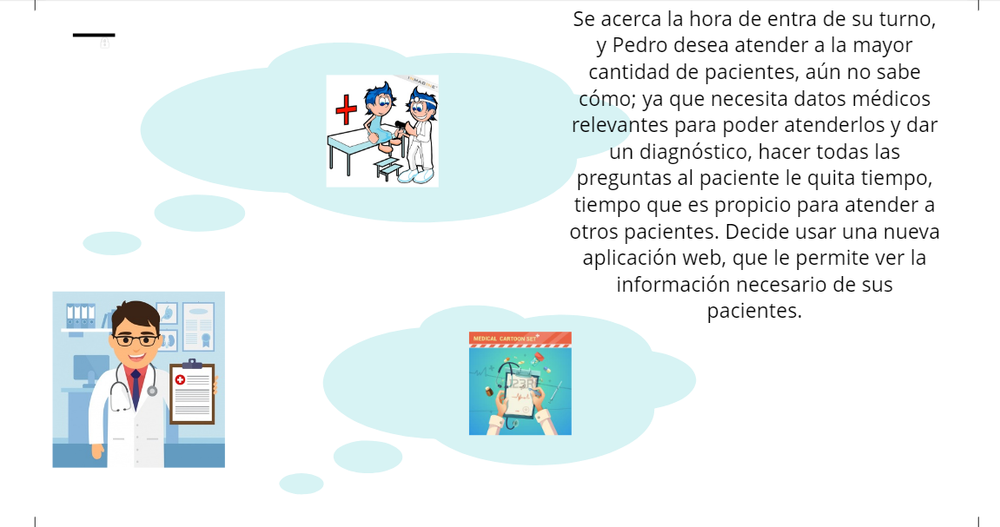
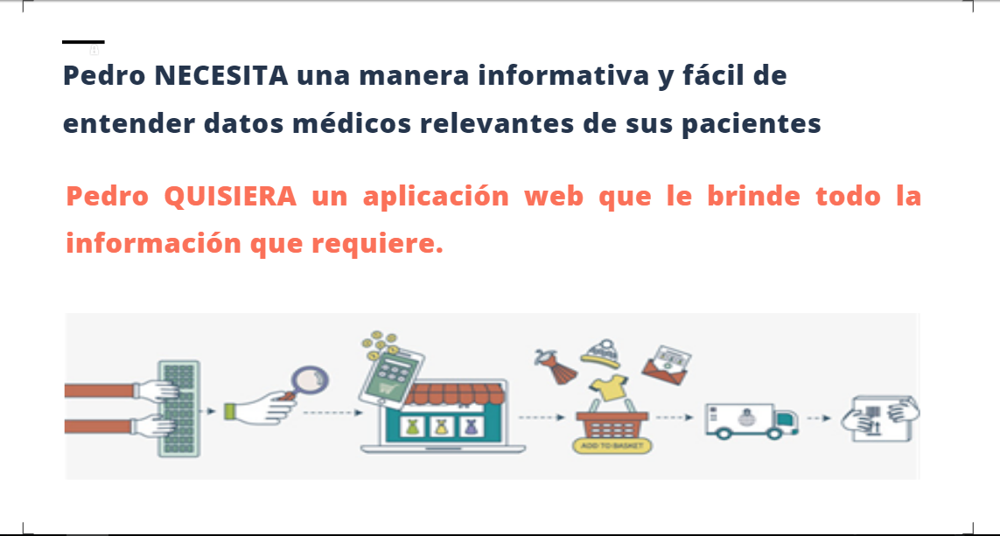
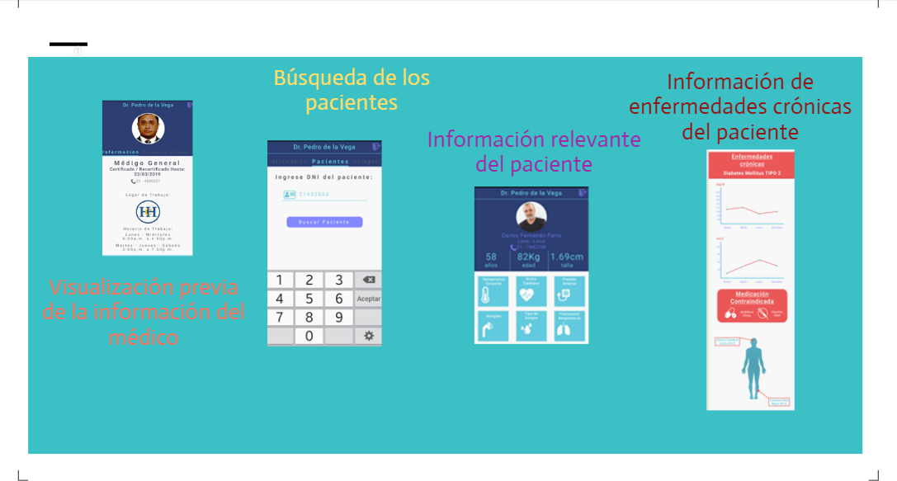
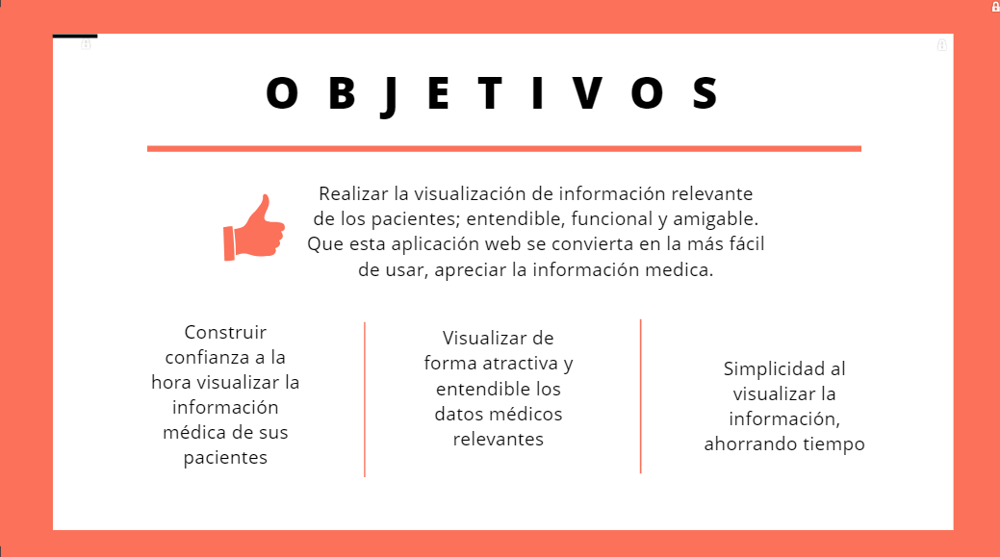
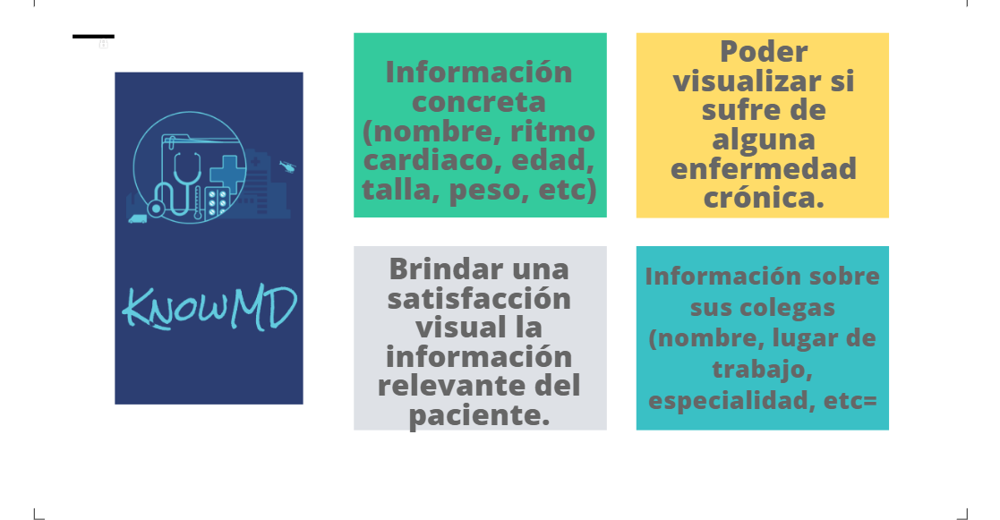

# KnowMD

KnowMD es una propuesta de un Dashboard Medical adaptado para celulares, permitiendo a un medico internista/generalista tener, a la mano, información relevante de sus pacientes. KnowMD es una herramienta digital muy potente, no solo para los medicos también para los hospitales / clínicas, ya que mantendrá al medico informado de manera concisa sobre su paciente, ahorrando tiempo en preguntas, y evitando inconvenientes en la medicación u otro tema importante. Además de tener métricas específicas del paciente.

## Research

### Entrevistas y Encuestas:

  Realizamos entrevistas a médicos para conocer los requerimientos y necesidades de ellos y de los pacientes al momento de atender una cita.
  Para ello nos enfocamos en médicos del Hospital Dos de Mayo, Hospital de la Solidaridad "UNI", Hospital Cayetano Heredia y la Clínica Centenario Peruano Japonés; con el fin de conocerlos, obtener obersaviciones y conocer los puntos claves a la hora de atender a un paciente.

  Entrevistados:

    * Martín Gutierrez

    * Pedro Eduardo de la Vega

    * Pedro Ernesto de la Vega

    * Karina Quichca

    * Sofía Quintana

  * Conclusiones de las Entrevistas:

  

### Etapa Previa:

#### Recolección de Información Previa:

    “Tenemos que hacer todo el acto médico de una patología crónica y una aguda en un periodo de 12 a 15 minutos, lo cual es prácticamente imposible”

    “El paciente viene con sus patologías crónicas y con otras necesidades adicionales, como un cuadro gripal o un dolor abdominal."

    "Significa que, al menos, se dedicarán 15 minutos por paciente. Incluir uno más, bajará el tiempo a 12 minutos.

    “La queja de los colegas es que tienen una gran cantidad de formularios para llenar que impiden esa interacción con el paciente”

    “Hay consultas que requieren más tiempo que otras, como cuando llegan pacientes con comorbilidades (muchas enfermedades a la vez)."

### Síntesis y Definición

  * ¿Qué debe proveer la KnowMD a los médicos?

 

 

## Detalles de la Propuesta

### User Persona:

   

### Escenario:

   

### Problem statements & How might we?

   

### Elementos que contendrá KnowMD:

   

### Objetivos de KnowMD:

   

### Ventajas y beneficios que Kwnow debe ofrecer:

   

## Prototipado

### Actividades:

    * Se utilizó Figma para el desarrollo de las vistas.
   [Ver Figma](https://www.figma.com/file/Ulw6HQfJKcgaPl2jfAoPAU1N/KnowMD?node-id=12%3A0)

    * Se utilizó Marv el para darle interacción a las vistas del Prototipo.

### Prototipo Alta Fidelidad Movil:

   [Ver Prototipo Movil](https://marvelapp.com/93437f1/screen/44387709)

## Testing

### Feedback:

    * Se realizacisó iteraciones con 4 médicos (Luis Abel Contreras, Christopher Pretell, Omar Varela, Melissa Díaz)

    * El usuario entro de manera fácil a la búsqueda de pacientes.

    * Le parece que es un manera de ahorrar tiempo con preguntas y llenado de formularios.

    * Pueden saber si el paciente sufre de alguna enfermedad.

    * Le pareció innecesario la información de los colegas.
